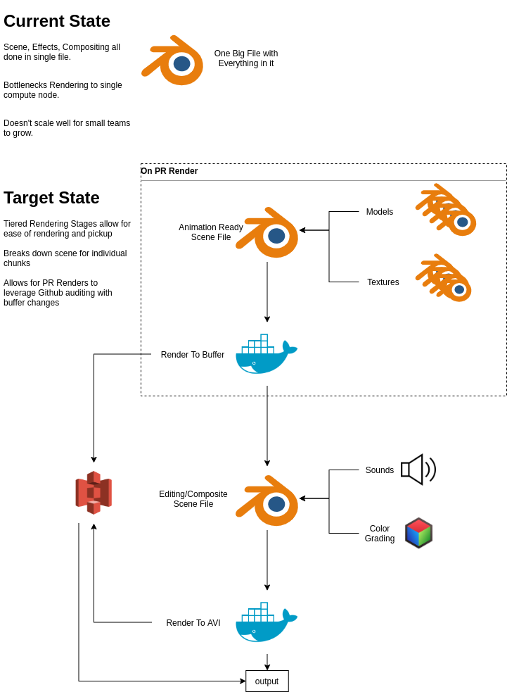

# blender-as-a-pipeline (BAAP)

Template pipeline for individual, small-team sized Blender project development.

Build | Status
 -- | -- 
Sample PR Render Build |  [](https://github.com/TennisGazelle/blender-pipeline/actions/workflows/pr_render.yml)
Sample Full Render Build | [](https://github.com/TennisGazelle/blender-pipeline/actions/workflows/render.yml)
Docker Container Creation Build | [](https://github.com/TennisGazelle/blender-pipeline/actions/workflows/docker.yml)


This uses Docker to run a small image of blender into a Github Action that has staged rendering.
The Stages in rendering are tightly coupled with the animator's workflow in mind.

**Docker Container:** https://hub.docker.com/r/tennisgazelle/blender-pipeline



# Quick start

### Prerequisites:
Needed to be installed/configured on your local machine.
 - python3
    - pyyaml
 - blender (technically optional)
 - docker
    - You may run `./scripts/install_docker_linux.sh` if you are using a linux machine.


### Set Up
Copy this repo's contents to your projects workdir.
Place your blender files into `blender/` and your image resource files into `imgs/resources`.  Be sure to relink everything.

#### Terminology - "Stage"
A stage is a specific rendering configuration, details in `config.yaml`, consisting of at least one blender file to be rendered.
The information held in such a stage includes:

```yaml
scene:
  buffer_frames: 1-9,11-20      # frames 1 through 20 except 10
  force_update: false           # force frame to rerender, even if file exists
  render_output: 'imgs/buffer/' # where to put the output of that file
  engine: CYCLES                # EEVEE support coming soon
  blend_file: scene.blend       # the blend file in question
  render_format: PNG            # what format the output should be in
  blender_flags: ''             # parameters for blender to be used in the docker call
file_output_format: '{bfile}_{stage}_####'
```

> for `blender_flags:`, use flags found for blender arguments [found here](https://docs.blender.org/manual/en/latest/advanced/command_line/arguments.html)

> `file_output_format` arguments:
> Arg | Desc
> -- | --
> `bfile` | Blender file
> `stage` | Name of stage
> `####` | Frame number

In this project, Stage `scene` refers to the blend file that contains the models/textures to be build, and stage `edit` includes the blender file with post processing.

#### Terminology - "Model"
A model is reference to an OBJ file outputted by a 3D modeler, void of static (image) and dynamic (procedural) texture information.  A model may be autorendered in turnstyle format based on configuration as defaulted below:

```yaml
models:
  - cool_cube:
    obj_file: 'blender/models/curve-skeleton-cube.obj'
    render_output: 'imgs/out/models/'
    scaling_factor: 1 # default (1)
    remove_doubles: true # default (false)
    edge_split: false # default (false)
    depth_scale: 1.4 # default (1.4)
    color_depth: 8 # default (8)
    format: PNG # default PNG
    video: false # default (false); if true, format is ____ and rotation_iteration will be 5 sec rotation at 30 fps (150)
    resolution: 600 # is square; default (600)
    rotation_iterations: 30 # default 6
    include:
      - color # default only one active
      - depth
      - normal
      - albedo
      - id
model_output_format: '{model}_{angle}_{map}
```

> `model_output_format` arguments:
> Arg | Desc
> -- | --
> `model` | name of model (ex. 'cool_cube')
> `objfile` | Object file
> `angle` | Angle of Camera [0-360)
> `map` | which type of map it is (see `models.MODEL_NAME.include` options)

In this project, `cool_cube` is the shape found in `blender/cool_scene.blend`. 

### Render
0. (optional) Set up the Docker image locally (this will take some time).
```bash
docker build -t blender-pipeline scripts/
```

You can also just download the image to save time
```bash
docker pull tennisgazelle/blender-pipeline:latest
```

1. If you just downloaded this project, first set the paths of your working directory.

```bash
make set_paths
```

You can verify the output of this with `make get_paths`

2. Render the scene stage
```bash
make scene_render
```

3. Render the post processing stage (edit)
```bash
make edit_render
```

Raw, individual frames will populate in imgs/buffer/ without post processing.
A video file will be found in imgs/out/ with post processing.


# Research and Bibliography
 - [**ikester/blender**](https://hub.docker.com/r/ikester/blender) - Dockerfile that has Blender in it
 - [**dolphinkiss/blender-python-docker**](https://github.com/dolphinkiss/blender-python-docker/blob/master/Dockerfile) - Similar to above; Dolphin Kiss's implementation is also simple and easy to understand.
 - [**Raymond Lo**](https://dis.co/blog/build-a-blender-docker-container-for-distributing-rendering/) - Article helping detail how to write one's own blender-based dockerfile and how to get dependencies in it.
 - [**Amber Wilkie - FreeCodeCamp**](https://www.freecodecamp.org/news/how-to-use-github-actions-to-call-webhooks/) - Calling webhooks from Github Actions.
 - Stack Overflow/Stack Exchange
    - [**Pip for Blender's Installed Python**](https://blender.stackexchange.com/questions/56011/how-to-install-pip-for-blenders-bundled-python)
 - [`mvoelk`'s fork of Stanford Shapenet Render](https://github.com/mvoelk/stanford-shapenet-renderer) - Object rendering suite for modelers
   - Props to both Stanford researchers and Github user `mvoelk` for his update for Blender 2.9
   - For Help: https://blender.stackexchange.com/questions/43346/how-do-you-set-the-current-image-as-far-as-bpy-is-concerned
   - Blender docs: 
     - https://docs.blender.org/api/current/bpy.data.html
     - https://docs.blender.org/manual/en/latest/advanced/command_line/arguments.html

# Links I want to use
 - https://towardsdatascience.com/how-to-properly-use-the-gpu-within-a-docker-container-4c699c78c6d1
 - https://tabreturn.github.io/code/blender/python/2020/11/01/a_quick_intro_to_blender_creative_coding-part_3_of_3.html